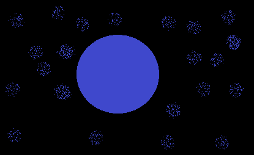

# Filtro de densidade usando Machine Learning e Clusterização

Nesse capítulo você irá aprender uma maneira rápida e fácil de utilizar Machine learning para remover ruídos em uma captura de objeto utilizando range de cores.

Nesse contexto, iremos utilizar o método DBSCAN da Lib SKLEARN para reorganizar os pontos das cores selecionadas e identificar áreas de baixa densidade.

**Obs. Os códigos contidos neste capítulo foram foram desenvolvidos para serem rodados no Google Colab e pode sofrer algumas alterações para rodar fora do Colab (exemplo: a utilização da lib google.colab.patches para visualizar imagens).**

## Preparando o ambiente

Para esse projeto é necessário que você tenha instalado os seguintes itens em sua máquina.

1. Editor de textos de sua preferência.

2. Python 3.8.5 .

3. Bibliotecas (**OpenCV**, **Collections**, **Sklearn**, **Numpy**).

Caso queira, pode utilizar o Google Colab que tem o ambiente praticamente pronto.

## Passos

### Importar Libs

```python
import numpy as np
import urllib
import cv2
from google.colab.patches import cv2_imshow
from collections import Counter
from sklearn.cluster import DBSCAN
from sklearn import metrics
from sklearn.datasets import make_blobs
from sklearn.preprocessing import StandardScaler
```

### Download da imagem

Baixamos a imagem diretamente da internet utilizando a lib Urlib e após isso, utilizamos as libs Numpy e Opencv para converter a imagem para um formato aceito pela lib OpenCV.

**Obs. Como estamos utilizando o Google Colab, estaremos realizando o download e conversão das imagens diretamente do Imgur.**
```python
def url_to_image(url):
    resp = urllib.request.urlopen(url)
    image = np.asarray(bytearray(resp.read()), dtype="uint8")
    image = cv2.imdecode(image, cv2.IMREAD_COLOR)
    hsv = cv2.cvtColor(image, cv2.COLOR_BGR2HSV)
    return hsv

url = f'https://i.imgur.com/PLGlnWj.png'

img = url_to_image(url)
```



### Seleção do range de cor

Este é um dos momentos mais demorados e manuais da aplicação, pois teremos que manualmente encontrar o range de cores utilizados no objeto que queremos selecionar.
No nosso caso é o Azul.

```python
img = url_to_image(url)
BLUE_MIN = (110,50,50)
BLUE_MAX = (130,255,255)

```

### Separação de pixels

Nesta parte do código percorremos todos os pixels da imagem, verificamos quais encontram-se dentro do range de cores selecionados e guardamos as coordenadas dos azuis dentro do array data_cord

```python
data_cord = []

height, width, channels = img.shape

for x in range(height): 
    for y in range(width):
        r, g, b = img[x,y]
        if (r,g,b) >= BLUE_MIN and (r,g,b) <= BLUE_MAX:
            data_cord.append([int(x),int(y)])
```

### DBSCAN

Agora, com o data_cord já separado, iremos utilizar DBSCAN para clusterizar os dados.
O DBSCAN é uma algoritmo de machine learning que clusteriza os dados com base em densidade e tamanho de cluster.

```python
X = StandardScaler().fit_transform(data_cord)
db = DBSCAN(eps=0.1, min_samples=1).fit(X)
core_samples_mask = np.zeros_like(db.labels_, dtype=bool)
core_samples_mask[db.core_sample_indices_] = True
labels = db.labels_
```
